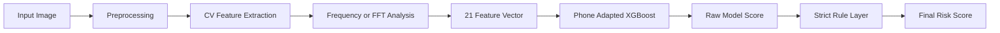
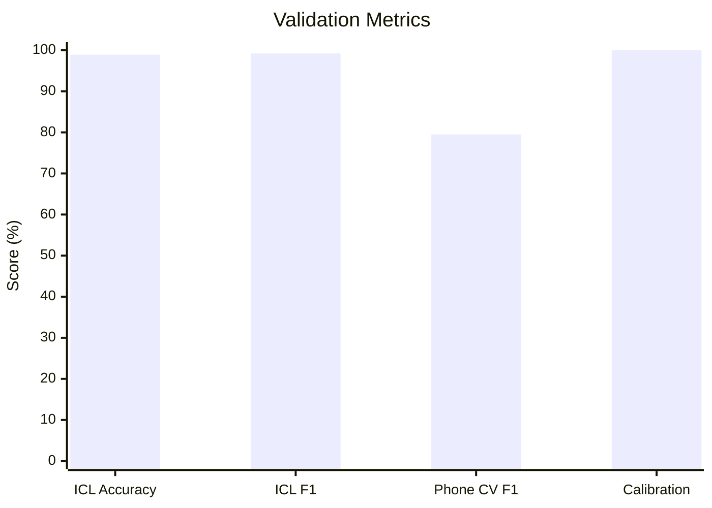
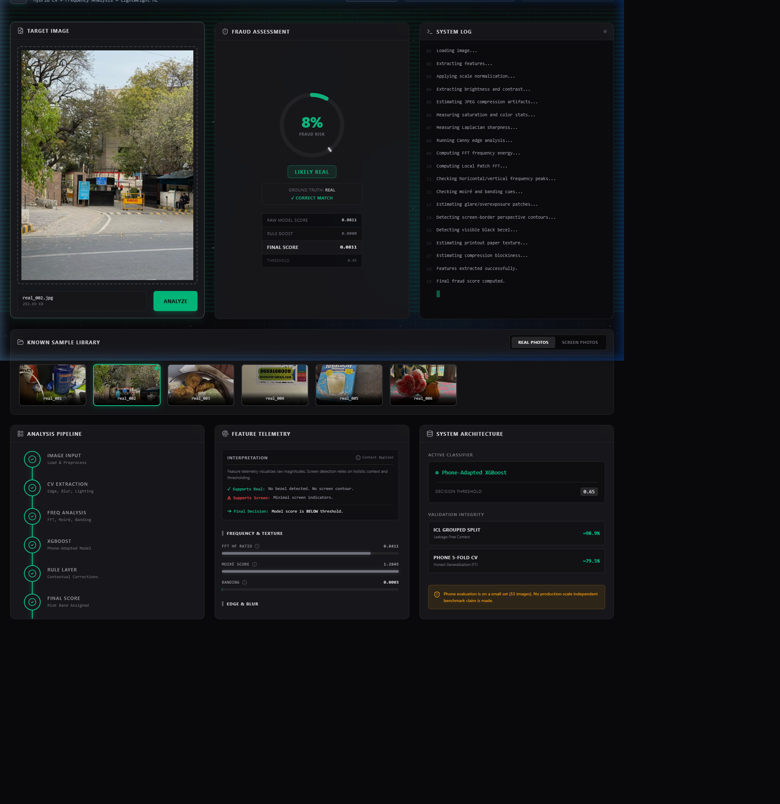
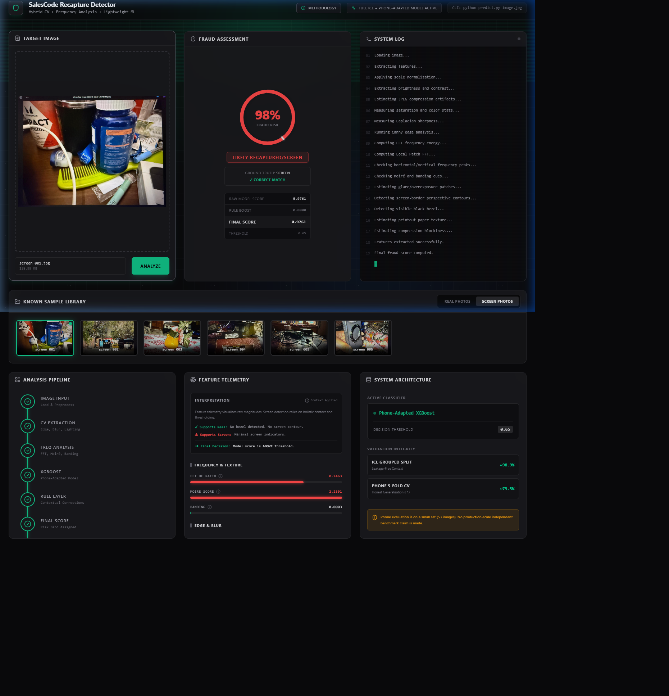

# SalesCode Recapture Detector

**Author:** Kartikeya

> ## 🎯 Accuracy Highlights
> 
> **ICL Dataset (Lab Photos):** 
> * **`~99.2% F1 Score`**
> 
> **Personal Phone Photos (~53 Real World Photos):** 
> * **`~79.5% Honest 5 Fold CV F1`** 
> * **`100% Calibration Score`**

A fast computer vision and machine learning pipeline that figures out if an image is a real photo or a picture of a screen or printout.

## Quick Summary

This project tackles the Spot the Fake Photo assignment. It gives you a score from 0 to 1. A score of 0 means it is a real camera photo, while 1 means it is a recaptured image from a screen or printout. Since the score is continuous, you can pick whatever threshold you want. I built a practical hybrid solution that runs completely on the CPU. You do not need a GPU or any paid APIs to run this.

## Assignment Requirement

```bash
python predict.py some_image.jpg
```

Expected output:

```text
0.93
```

* 0 means real
* 1 means screen or printout or recaptured

## What I Used

This is not a giant black box model. Here is the stack:

| Component               | Used For                                                | Why                                                     |
| ----------------------- | ------------------------------------------------------- | ------------------------------------------------------- |
| Phone Adapted XGBoost   | Final learned classifier                                | Lightweight, fast on CPU, works on 21 numeric features  |
| OpenCV image processing | Brightness, contrast, sharpness, edges, glare, contours | Captures physical and camera artifacts                  |
| Frequency analysis      | FFT, local frequency, moiré, banding                    | Detects screen and recapture patterns                   |
| Rule based correction   | Multi cue screen evidence and natural scene safeguards  | Stops one noisy feature from ruining the score          |
| Transparent scoring     | raw_model_score + rule_boost_total = final_score        | Makes predictions easy to audit                         |

## Why This Fits the Assignment

The assignment lets us use a trained model, classical CV, frequency analysis, or any custom algorithm. I went with a hybrid approach because catching recaptured images is about spotting artifacts, not recognizing objects. A real photo and a fake photo can both show the exact same flower or building. The giveaway is usually second capture artifacts like moiré, banding, screen glare, blur, compression, and weird frequency spikes.

## Why Not a Heavy Deep Model?

A massive CNN could work, but it ignores the constraints of the assignment. The final system might run on a phone one day, so the solution needs to be small, fast, and cheap. I used handcrafted features and XGBoost because inference is super easy on a CPU, the model file is tiny, and it is much easier to explain why it made a decision. The design is totally fine for future mobile deployment.

## Method: Hybrid CV + Frequency + Lightweight ML

### A. Preprocessing
Images are loaded and resized. A light Gaussian blur removes sensor noise before the frequency analysis step. The code easily handles JPG, PNG, and mobile image formats. It converts them to both RGB and grayscale to feed different feature families.

### B. Classic CV and Image Processing
We look at the visual and structural signs of how a photo was captured. This means checking brightness, contrast compression, saturation, and Laplacian sharpness. The model also checks Sobel edge magnitude and edge density to spot the blur you get when aiming a camera at a screen. It also actively looks for overexposed display patches, printout textures, and rectangular screen borders.

### C. Frequency Analysis
Digital displays shine light through a tight pixel grid. When you photograph them with another camera, you get structured frequency artifacts. I use signal processing to measure global FFT high frequency energy and local patch FFTs. The pipeline also calculates moiré and banding cues by looking for repeating horizontal, vertical, and diagonal frequency peaks from LCD row and column layouts.

### D. Trained Model and Final Formula
All extracted features go into an XGBoost classifier trained to output a raw screen probability. A strict rule layer then adds multi cue boosts only when several screen cues agree. This stops false positives from natural scenes or random compression artifacts.

```text
final_score = clamp(raw_model_score + rule_boost_total, 0, 1)
```

Prediction logic:
```text
final_score >= 0.65 → screen or recaptured
final_score < 0.65  → real
```

## Pipeline Diagram



## Risk Bands

| Score Range | UI Label                  | Meaning                          |
| ----------- | ------------------------- | -------------------------------- |
| 0.00 to 0.35| Likely Real               | Strong direct photo evidence     |
| 0.35 to 0.65| Borderline                | Ambiguous or mixed signals       |
| 0.65 to 1.00| Likely Recaptured         | Strong recapture screen evidence |

## Model Metrics

| Metric                  |  Value | Validation Method                                 | Notes                              |
| ----------------------- | -----: | ------------------------------------------------- | ---------------------------------- |
| ICL Accuracy            | ~98.9% | GroupShuffleSplit                                 | Leakage free grouped split         |
| ICL F1                  | ~99.2% | GroupShuffleSplit                                 | Dataset domain metric              |
| Phone CV F1             | ~79.5% | 5 Fold Stratified CV                              | Honest small phone domain estimate |
| Phone Calibration Score |   100% | Same 53 phone images used for threshold selection | Calibration only, not independent  |
| Threshold               |   0.65 | Selected after calibration                        | Used for final decision            |

> [!WARNING]
> Important: The 100% phone calibration score is not an independent benchmark. It uses the same 53 images that were involved in picking the threshold. The honest phone domain generalization estimate is ~79.5% F1 from a 5 fold CV. I am making no claims about production accuracy here.

## Metric Chart



**Plain text fallback:**
```text
ICL Accuracy        ████████████████████ 98.9%
ICL F1              ████████████████████ 99.2%
Phone CV F1         ████████████████░░░░ 79.5%
Phone Calibration   ████████████████████ 100%*
```
`*Calibration only, not independent validation.`

## Screenshots

### Example 1: Real Image


### Example 2: Screen Image


## Example Behavior

A normal real flower or window image now gets a low score after I audited the features. Direct real objects and text correctly classify as real even if they have labels, books, or posters in them. Screen images usually get high scores because of display and recapture artifacts. Borderline scores are totally expected for weird ambiguous cases.

| File                 | Ground Truth     | Score | Prediction      | Notes                        |
| -------------------- | ---------------- | ----: | --------------- | ---------------------------- |
| real/outdoor.png     | Real             |  0.07 | Real            | Direct outdoor physical scene |
| real/books.png       | Real             |  0.40 | Borderline Real | Direct object photo, some texture or compression |
| flower_screen.jpeg   | Screen           |  0.98 | Screen          | Recaptured screen example    |
| screen/laptop.png    | Screen Ambiguous |  0.29 | Miss Borderline | Synthetic image lacked real recapture artifacts |

## Challenges and Feature Refinement

Real images can contain text, posters, labels, books, signs, windows, shadows, glare, shiny objects, and natural high frequency textures that perfectly mimic screen frequencies. On the flip side, recaptured images can look just like normal photos without a visible bezel, and heavy JPEG compression can mimic screen blockiness.

Earlier versions of my feature logic misfired hard. Naive global FFT, moiré scores, and bezel glare detection triggered incorrectly on natural elements like flower petals or sunlight. 

To fix this, I added a contextual moiré flatness penalty and forced the bezel glare logic to look for a rectangular screen like contour first. I dropped the weight on global FFT peak energy to focus more on local artifacts, made the rule boosts way more strict and requiring multiple cues, and made the scoring completely transparent so you can see exactly what the raw model score and rule boost total are.

## Final Model Configuration

| Item          | Value                    |
| ------------- | ------------------------ |
| Model         | Phone Adapted XGBoost    |
| Feature count | 21                       |
| Threshold     | 0.65                     |
| Normal output | Single float from 0 to 1 |
| Debug mode    | `--json`                 |
| Rule bypass   | `--json --no-rules`      |

## Future Improvements

Next steps would be collecting a lot more diverse phone photos, printout examples, and imagery across totally different devices, screens, and lighting setups to build a true held out independent phone test set. This will make calibration much better. It would also be great to add SHAP explanations, try out a tiny MobileNet or ONNX model for edge cases, and pull in more external recapture datasets after doing a thorough license and label audit.

## Dataset Sources

This project relies on the ICL Single Capture and Recaptured Image Database plus my own user phone dataset. I completely avoided random unlabeled Google images and AI generated images. Any external datasets were strictly licensed and audited. See [DATASET_SOURCES.md](DATASET_SOURCES.md) for full details.

## Running Locally

```bash
pip install -r requirements.txt
python predict.py path/to/image.jpg
python predict.py path/to/image.jpg --json
uvicorn backend.app:app --host 127.0.0.1 --port 8000
cd frontend
npm install
npm run dev
```

## Deployment

See [DEPLOYMENT.md](DEPLOYMENT.md) for Hugging Face Docker Space deployment.

- Docker Space
- port 7860
- do not upload dataset
- deploy only model/backend/frontend/docs
