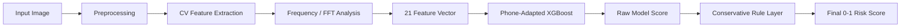
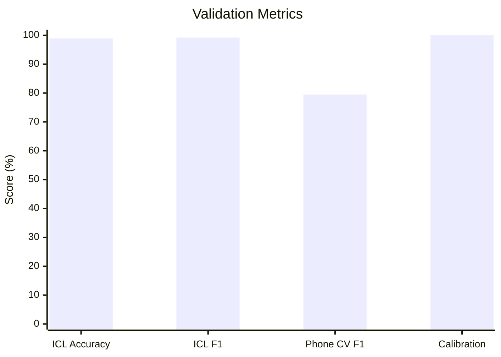

# SalesCode Recapture Detector

**Author:** Kartikeya

> ## 🎯 Accuracy Highlights
> 
> **ICL Dataset (Lab Photos):** 
> * **`~99.2% F1 Score`**
> 
> **Personal Phone Photos (~53 Real-World Photos):** 
> * **`~79.5% Honest 5-Fold CV F1`** 
> * **`100% Calibration Score`**

A lightweight computer-vision and ML pipeline for detecting whether an image is a direct real photo or a recaptured/screen/printout photo.

## Quick Summary

This project solves the "Spot the Fake Photo" assignment by outputting a score between 0 and 1. A score of 0 means a real direct camera photo, while 1 means a recaptured, screen, or printout photo. The score is continuous, allowing the evaluator to set any threshold. We use a lightweight, evaluator-friendly hybrid approach that runs entirely on the CPU without requiring any GPU or paid APIs.

## Assignment Requirement

```bash
python predict.py some_image.jpg
```

Expected output:

```text
0.93
```

- 0 means real
- 1 means screen/printout/recaptured

## What We Used

This solution is not just a black-box model. It combines:

| Component               | Used For                                                | Why                                                     |
| ----------------------- | ------------------------------------------------------- | ------------------------------------------------------- |
| Phone-Adapted XGBoost   | Final learned classifier                                | Lightweight, CPU-friendly, works on 21 numeric features |
| OpenCV image processing | Brightness, contrast, sharpness, edges, glare, contours | Captures physical/camera artifacts                      |
| Frequency analysis      | FFT, local frequency, moiré, banding                    | Detects screen/recapture patterns                       |
| Rule-based correction   | Multi-cue screen evidence and natural-scene safeguards  | Prevents one noisy feature from dominating              |
| Transparent scoring     | raw_model_score + rule_boost_total = final_score        | Makes predictions auditable                             |

## Why Our Approach Fits the Assignment

The assignment explicitly allows a trained model, classical CV, frequency analysis, or any custom algorithm. We used a hybrid because recapture detection is artifact detection, not object recognition. A real and fake image can contain the same flower, building, or object. The difference is usually in second-capture artifacts such as moiré, banding, display glare, blur, compression, and frequency changes.

## Why Not a Heavy Deep Model?

A large CNN could work, but it would be less aligned with this assignment’s constraints. The target system may eventually run on a phone, so the solution should be small, fast, and cheap. This project uses handcrafted features plus XGBoost because inference is CPU-friendly, the model is small, and the reasoning is easier to explain. The design is suitable for future mobile deployment.

## Method: Hybrid CV + Frequency + Lightweight ML

### A. Preprocessing

Images are loaded and resized to a consistent scale, with a light Gaussian blur applied before frequency analysis to remove sensor noise. The pipeline robustly handles JPG, PNG, and mobile image formats, converting them to both RGB and grayscale to support different feature families.

### B. Classic CV/Image Processing

We extract visual and structural properties of how a photo was captured. This includes evaluating brightness, contrast compression, saturation, and Laplacian sharpness. The model also analyzes Sobel edge magnitude and edge density to detect camera-on-screen blur, while explicitly looking for display overexposure patches, printout textures, and rectangular screen-like border contours.

### C. Frequency Analysis

Digital displays emit light through a regular pixel grid. When photographed by another camera, this creates structured frequency artifacts. We use signal processing to measure global FFT high-frequency energy and local patch FFTs. We also compute moiré and banding cues, checking for periodic horizontal, vertical, and diagonal frequency peaks from LCD row and column structures.

### D. Trained Model & Final Formula

All extracted features are fed into an XGBoost classifier trained to output a raw screen probability. A conservative rule layer then applies multi-cue boosts only when multiple screen cues agree, avoiding false positives from natural scenes or single compression artifacts.

```text
final_score = clamp(raw_model_score + rule_boost_total, 0, 1)
```

Prediction logic:

```text
final_score >= 0.65 → screen / recaptured
final_score < 0.65  → real
```

## Pipeline Diagram



## Risk Bands

| Score Range | UI Label                  | Meaning                          |
| ----------- | ------------------------- | -------------------------------- |
| 0.00–0.35   | Likely Real               | Strong direct-photo evidence     |
| 0.35–0.65   | Borderline / Needs Review | Ambiguous or mixed signals       |
| 0.65–1.00   | Likely Recaptured/Screen  | Strong recapture/screen evidence |

## Model Metrics

| Metric                  |  Value | Validation Method                                 | Notes                              |
| ----------------------- | -----: | ------------------------------------------------- | ---------------------------------- |
| ICL Accuracy            | ~98.9% | GroupShuffleSplit                                 | Leakage-free grouped split         |
| ICL F1                  | ~99.2% | GroupShuffleSplit                                 | Dataset-domain metric              |
| Phone CV F1             | ~79.5% | 5-fold Stratified CV                              | Honest small phone-domain estimate |
| Phone Calibration Score |   100% | Same 53 phone images used for threshold selection | Calibration only, not independent  |
| Threshold               |   0.65 | Selected after calibration                        | Used for final decision            |

> [!WARNING]
> Important: The 100% phone calibration score is not an independent benchmark. It used the same 53 images involved in threshold selection. The honest phone-domain generalization estimate is ~79.5% F1 from 5-fold CV. No production accuracy claim is made.

## Metric Chart



**Plain-text fallback:**

```text
ICL Accuracy        ████████████████████ 98.9%
ICL F1              ████████████████████ 99.2%
Phone CV F1         ████████████████░░░░ 79.5%
Phone Calibration   ████████████████████ 100%*
```

`*Calibration only, not independent validation.`

## Screenshots

### Example 1 — Real Image


### Example 2 — Screen Image


## Example Behavior

A direct real flower or window image now scores low after our feature audit. Direct real objects and text can be classified as real even if they contain labels, books, or posters. Screen images typically score high because of display and recapture artifacts. Borderline scores are expected for ambiguous cases.

| File               | Ground Truth     | Score | Prediction      | Notes                                           |
| ------------------ | ---------------- | ----: | --------------- | ----------------------------------------------- |
| real/outdoor.png   | Real             |  0.07 | Real            | Direct outdoor/physical scene                   |
| real/books.png     | Real             |  0.40 | Borderline/Real | Direct object photo, some texture/compression   |
| flower_screen.jpeg | Screen           |  0.98 | Screen          | Recaptured/screen example                       |
| screen/laptop.png  | Screen/Ambiguous |  0.29 | Miss/Borderline | Synthetic image lacked real recapture artifacts |

## Challenges and Feature Refinement

Real images can contain text, posters, labels, books, signs, windows, shadows, glare, shiny objects, and natural high-frequency textures that mimic screen frequencies. Conversely, recaptured images can look like normal photos without a visible bezel, and JPEG compression can mimic screen blockiness.

Earlier feature logic overfired because naive global FFT, moiré scores, and bezel/glare detection triggered incorrectly on natural elements (like flower petals or sunlight).

To fix this, we implemented a contextual moiré flatness penalty and required bezel/glare to occur within a rectangular screen-like contour. We downweighted global FFT peak energy to focus on local artifacts, made rule boosts conservative and multi-cue only, and ensured transparent scoring to expose the exact raw model score and rule boost total.

## Final Model Configuration

| Item          | Value                    |
| ------------- | ------------------------ |
| Model         | Phone-Adapted XGBoost    |
| Feature count | 21                       |
| Threshold     | 0.65                     |
| Normal output | Single float from 0 to 1 |
| Debug mode    | `--json`                 |
| Rule bypass   | `--json --no-rules`      |

## Future Improvements

Future iterations should collect more diverse phone photos, printout examples, and imagery spanning various devices, screens, and lighting conditions to create a true held-out independent phone test set. This will improve calibration with more data. We also recommend adding SHAP or feature contribution explanations, experimenting with a tiny MobileNet/ONNX/TFLite model for edge cases, and integrating more external recapture datasets after a thorough license and label audit.

## Dataset Sources

This project relies on the ICL Single-Capture and Recaptured Image Database alongside a user phone dataset. No random unlabeled Google images or AI-generated images were used as real photos, and external datasets were strictly licensed and audited. See [DATASET_SOURCES.md](DATASET_SOURCES.md) for full details.

## Running Locally

```bash
pip install -r requirements.txt
python predict.py path/to/image.jpg
python predict.py path/to/image.jpg --json
uvicorn backend.app:app --host 127.0.0.1 --port 8000
cd frontend
npm install
npm run dev
```

## Deployment

See [DEPLOYMENT.md](DEPLOYMENT.md) for Hugging Face Docker Space deployment.

- Docker Space
- port 7860
- do not upload dataset
- deploy only model/backend/frontend/docs
